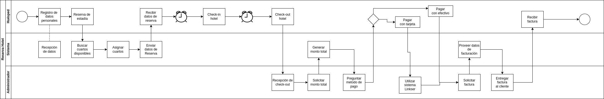

# Reserva de Hotel

## Descripción
Este proyecto contiene una API REST que permite administrar las entidades más importantes en un hotel, además de realizar reservas y generar la facturación para la estadía de huéspedes de un hotel. Las tecnologías usadas son Node.js y Express.js para la configuración del servidor y PostgreSQL para la gestión de la base de datos.

## Endpoints

### CRUD

El primer tipo de endpoint que he creado es el que nos permite poder crear, leer, actualizar y eliminar cada elemento que se encuentre en el sistema. Estos endpoints tienen como objetivo poder simular los datos de un hotel, para que posteriormente podamos crear el flujo de datos de las demás funcionalidades que requiera el sistema. Estos son los siguientes:

1. CRUD Hoteles
2. CRUD Huespedes
3. CRUD Reservas
4. CRUD Facturas
5. CRUD Habitaciones

### Registro de huésped

```js
const createGuest = async (req, res) => {
    try {
        const {first_name, last_name, gender, phone, email, country, city} = req.body;
        const newGuest = await pool.query(
            "INSERT INTO guests (first_name, last_name, gender, phone, email, country, city) VALUES($1, $2, $3, $4, $5, $6, $7) RETURNING *",
             [first_name, last_name, gender, phone, email, country, city]
             );
        res.json(newGuest.rows);
    } catch (err) {
        console.error(err.message); 
    }
};
```
- Descripción: Creación de un huésped mediante su registro. Es el primer proceso en el flujo de información. Este es necesario ya que el huesped tiene que registrarse para hacer la reserva.
- Input: Datos del Cliente
- Output: Información del cliente en JSON expresados en formato de la base de datos.

### Registro de Reserva
```js
const createBooking = async (req, res) => {
    try {
        const {booking_date, arrival_date, departure_date, num_persons, booking_state, hotel_id, guest_id} = req.body;
        const newBooking = await pool.query(
            "INSERT INTO bookings (booking_date, arrival_date, departure_date, num_persons, booking_state,  hotel_id, guest_id) VALUES($1, $2, $3, $4, $5, $6, $7) RETURNING *",
             [booking_date, arrival_date, departure_date, num_persons, booking_state,  hotel_id, guest_id]
             );
        const numberOfRoomsNeeded = Math.round(num_persons/2);
        let newJsonData = {
            "rooms_needed": numberOfRoomsNeeded
        }
        newBooking.rows.push(newJsonData);
        res.json(newBooking.rows);
    } catch (err) {
        console.error(err.message); 
    }
};
```
- Descripción: Creación de una reserva por parte del huésped. En este endpoint se calcula el número de habitaciones que necesitaría el huésped, según el número de acompañantes que tenga.
- Input: Datos de la reserva
- Output: Numero de habitaciones necesarias
### Buscar cuartos disponibles
```js
const findAvailableRooms = async (req,res) => {
    try {
        const availableRooms = await pool.query("SELECT * FROM rooms where occupancy=false");
        let jsonRooms = {
            "rooms_available": availableRooms.rows
        }
        res.json(jsonRooms);
    } catch (err) {
        console.error(err.message);
    }
}
```
- Descripción: Busqueda de habitaciones que no se encuentren ocupadas por otros huespedes. Para esto nos servimos del campo *occupancy* (tenencia) de la tabla rooms. Este endpoint le sería útil tanto al administrador en recepción del hotel, o para un supuesto registro virtual.
- Input: n/a
- Output: Numero de habitaciones desocupadas
### Asignar habitaciones a huésped
```js
const assignRooms = async (req,res) =>{
    try {
        const {id} = req.params;
        const rooms = req.body;
        const roomsArray = [];
        rooms.roomsSelected.forEach( room => {
            roomsArray.push(room.room_number);
        })
        const updateOccupancy = await pool.query("UPDATE rooms SET occupancy=true, booking_id=$1 where room_number=ANY($2)",[id, roomsArray]);
        res.json("Cuartos asignados: "+updateOccupancy.rowCount);

    } catch (err) {
        console.error(err.message)
    }
}
```
- Descripción: Se hace una relación entre las habitaciones y el número de la reserva. De esta forma, los cuartos quedan inhabilitados para otras reservas.
- Input: El id de la reserva
- Output: Los cuartos asignados al huésped
### Generar datos de Facturación
```js
const createBill = async (req, res) => {
    try {
        const {id} = req.params;
        const guest_id = id;
        const {payment_option,rate} = req.body;
        const total_amount = await generateTotalAmount(guest_id, rate);
        const payment_date = new Date();
        const booking_id = await getBookingId(guest_id);
        const newBill = await pool.query(
            "INSERT INTO bills (total_amount, payment_date, payment_option, booking_id, guest_id) VALUES($1, $2, $3, $4, $5) RETURNING *",
             [total_amount, payment_date, payment_option, booking_id, guest_id]
             );
        await changeBookingState(booking_id);
        await deallocateRooms(booking_id);
        res.json(newBill.rows);
    } catch (err) {
        console.error(err.message); 
    }
};
```
- Descripción: Se genera una factura con el cálculo del monto total de la estadía en el hotel. Este se genera multiplicando el número de noches, por las habitaciones usadas y por la tarifa. Además, se cambia el estado de la reserva a "pagado" y las habitaciones vuelven a estar disponibles.
- Input: El id del huésped
- Output: Los datos de facturación
## Modelo ER Base de Datos


## Diagrama de flujo de reserva y pago

